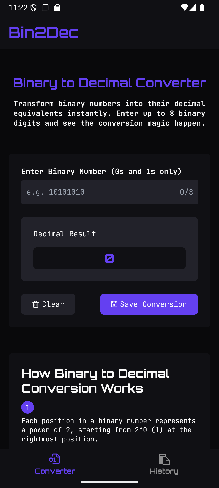

# Bin2Dec

A simple, modern React Native app to convert binary numbers to decimal, save conversions with notes, and view your conversion history. Built with Expo, Zustand, and TypeScript.

---

## Features

- **Binary to Decimal Conversion:** Instantly convert up to 8-digit binary numbers to decimal.
- **Save Conversions:** Save conversions with optional notes for future reference.
- **History:** View and delete your saved conversions.
- **Responsive UI:** Clean, accessible interface with light/dark theme support.
- **Persistent Storage:** Your history is saved locally using AsyncStorage.

---

## Screenshots


---

## Getting Started

### Prerequisites

- [Node.js](https://nodejs.org/)
- [Expo CLI](https://docs.expo.dev/get-started/installation/)
- [Yarn](https://yarnpkg.com/) or [npm](https://www.npmjs.com/)

### Installation

1. **Clone the repository:**
   ```sh
   git clone https://github.com/AnasPlusAnas/binary2decimal.git
   cd binary2decimal
   ```

2. **Install dependencies:**
   ```sh
   npm install
   # or
   yarn install
   ```

3. **Start the Expo development server:**
   ```sh
   npm start
   # or
   yarn start
   ```

4. **Run on your device or emulator:**
   - Press `a` for Android, `i` for iOS, or scan the QR code with the Expo Go app.

---

## Project Structure

```
bin2dec/
├── app/                # App entry points and navigation
│   └── (tabs)/         # Tab screens (index.tsx, history.tsx)
├── components/         # Shared components and hooks
├── constants/          # Theme and app constants
├── store/              # Zustand store for conversions
├── utils/              # Utility functions (e.g., validation)
├── assets/             # Fonts and images
├── package.json
└── ...
```

---

## Key Technologies

- [React Native](https://reactnative.dev/)
- [Expo](https://expo.dev/)
- [Zustand](https://zustand.docs.pmnd.rs/getting-started/introduction)
- [TypeScript](https://www.typescriptlang.org/)
- [AsyncStorage](https://react-native-async-storage.github.io/async-storage/)
- [Expo Crypto](https://docs.expo.dev/versions/latest/sdk/crypto/)

---

## Scripts

- `npm start` / `yarn start` — Start the Expo dev server

---

## Contributing

Pull requests are welcome!

---

## License

MIT

---

## Acknowledgements

- [Expo](https://expo.dev/)
- [Zustand](https://zustand-demo.pmnd.rs/)
- [React Native Animated Rolling Numbers](https://github.com/TronSha/react-native-animated-rolling-numbers)
